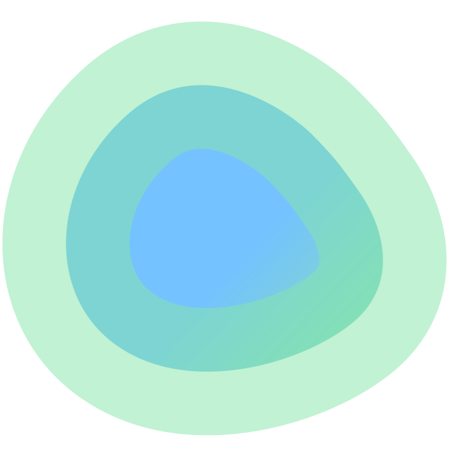

<div align="center" width="100%">
    
</div>

# Dockge

A fancy, easy-to-use and reactive self-hosted docker compose.yaml stack-oriented manager.

> **This is a fork of [louislam/dockge](https://github.com/louislam/dockge).** The backend has been rewritten in Go (no Node.js runtime required) and the frontend has been fully modernised — Pinia state management, Vue Composition API throughout, strict TypeScript, and a responsive layout that works on narrow screens. See [What's different](#this-fork) for details.

[](https://github.com/rahbut/dockge) [](https://github.com/rahbut/dockge/commits/main/)


View Video: https://youtu.be/AWAlOQeNpgU?t=48

## ⭐ Features

- 🧑‍💼 Manage your `compose.yaml` files
  - Create/Edit/Start/Stop/Restart/Delete
  - Update Docker Images
- ⌨️ Interactive Editor for `compose.yaml`
- 🦦 Interactive Web Terminal
- 🕷️ (1.4.0 🆕) Multiple agents support - You can manage multiple stacks from different Docker hosts in one single interface
- 🏪 Convert `docker run ...` commands into `compose.yaml`
- 📙 File based structure - Dockge won't kidnap your compose files, they are stored on your drive as usual. You can interact with them using normal `docker compose` commands


- 🚄 Reactive - Everything is just responsive. Progress (Pull/Up/Down) and terminal output are in real-time
- 🐣 Easy-to-use & fancy UI - If you love Uptime Kuma's UI/UX, you will love this one too


## What's different

This repository is a fork of [louislam/dockge](https://github.com/louislam/dockge) with a significantly reworked frontend and a rewritten backend in Go.

**Frontend changes:**
- Migrated from Vue 3 Options API to Composition API (`<script setup>`) throughout
- Replaced ad-hoc `$root`/`$parent` state with [Pinia](https://pinia.vuejs.org/) stores
- Responsive layout — collapsible sidebar, slide-over drawer on narrow screens, tabbed Compose detail pane on mobile
- Full TypeScript strict mode with `vue-tsc` — zero type errors
- ESLint clean — passes the upstream CI lint check without modifications

**Backend changes:**
- Original Node.js/TypeScript backend replaced with a Go binary
- Single self-contained executable — no Node.js runtime required at deployment
- Faster startup, lower memory footprint, simpler distribution

**Image:**
- Upstream is built on the Node.js 22 runtime image (~720 MB uncompressed)
- This fork uses `gcr.io/distroless/base-debian12` as the base — containing only glibc, CA certificates, and tzdata; no shell, no package manager, no Node.js runtime
- Significantly smaller image with a substantially reduced attack surface

**Architecture:**
- Supported: `linux/amd64`, `linux/arm64`, `linux/arm/v7`

## 🔧 How to Install

Requirements:
- [Docker](https://docs.docker.com/engine/install/) 20+ / Podman
- (Podman only) podman-docker (Debian: `apt install podman-docker`)
- OS:
  - Major Linux distros that can run Docker/Podman such as:
     - ✅ Ubuntu
     - ✅ Debian (Bullseye or newer)
     - ✅ Raspbian (Bullseye or newer)
     - ✅ CentOS
     - ✅ Fedora
     - ✅ ArchLinux
  - ❌ Debian/Raspbian Buster or lower is not supported
  - ❌ Windows is not supported
- Arch: `amd64` (x86_64), `arm64`, `arm/v7` (32-bit)

### Basic

- Default Stacks Directory: `/opt/stacks`
- Default Port: 5001

```
# Create directories that store your stacks and stores Dockge's stack
mkdir -p /opt/stacks /opt/dockge
cd /opt/dockge

# Download the compose.yaml
curl https://raw.githubusercontent.com/rahbut/dockge/main/compose.yaml --output compose.yaml

# Start the server
docker compose up -d

# If you are using docker-compose V1 or Podman
# docker-compose up -d
```

Dockge is now running on http://localhost:5001

## How to Update

```bash
cd /opt/dockge
docker compose pull && docker compose up -d
```

## Screenshots


## Motivations

- I have been using Portainer for some time, but for the stack management, I am sometimes not satisfied with it. For example, sometimes when I try to deploy a stack, the loading icon keeps spinning for a few minutes without progress. And sometimes error messages are not clear.
- Try to develop with ES Module + TypeScript

If you love this project, please consider giving it a ⭐.


## 🗣️ Community and Contribution

### Bug Report
https://github.com/rahbut/dockge/issues

### Ask for Help / Discussions
https://github.com/rahbut/dockge/discussions

### Translation
If you want to translate Dockge into your language, please read [Translation Guide](https://github.com/rahbut/dockge/blob/main/frontend/src/lang/README.md)


## FAQ

#### "Dockge"?

"Dockge" is a coinage word which is created by myself. I originally hoped it sounds like `Dodge`, but apparently many people called it `Dockage`, it is also acceptable.

The naming idea came from Twitch emotes like `sadge`, `bedge` or `wokege`. They all end in `-ge`.

#### Can I manage a single container without `compose.yaml`?

The main objective of Dockge is to try to use the docker `compose.yaml` for everything. If you want to manage a single container, you can just use Portainer or Docker CLI.

#### Can I manage existing stacks?

Yes, you can. However, you need to move your compose file into the stacks directory:

1. Stop your stack
2. Move your compose file into `/opt/stacks/<stackName>/compose.yaml`
3. In Dockge, click the " Scan Stacks Folder" button in the top-right corner's dropdown menu
4. Now you should see your stack in the list

#### Is Dockge a Portainer replacement?

Yes or no. Portainer provides a lot of Docker features. While Dockge is currently only focusing on docker-compose with a better user interface and better user experience.

If you want to manage your container with docker-compose only, the answer may be yes.

If you still need to manage something like docker networks, single containers, the answer may be no.

#### Can I install both Dockge and Portainer?

Yes, you can.

## Others

Dockge is built on top of [Compose V2](https://docs.docker.com/compose/migrate/). `compose.yaml`  also known as `docker-compose.yml`.
